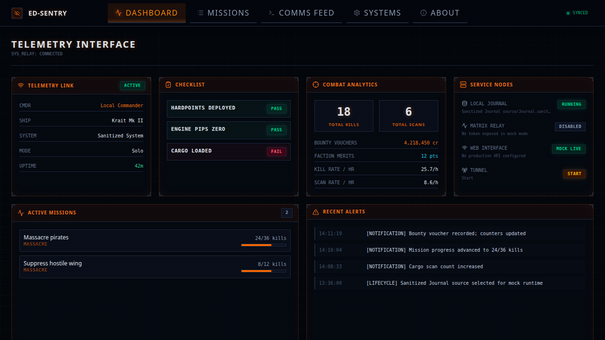

# ED Sentry


**ED Sentry** is an Elite Dangerous AFK monitoring dashboard for commanders. It watches your local Journal files and shows combat, service-node, tunnel, mission, and session status in a tactical desktop/Web interface.



It is unofficial third-party software. It only reads local Journal, `Status.json`, and `Cargo.json` files; it does not inject into the game, press keys, relog, or automate the client.

## Download

### Windows

[Download ED Sentry for Windows](https://smartrelease.bytedream.dev/github/ControlNet/ed-sentry/ed-sentry-v{major}.{minor}.{patch}-windows-x64.zip)

1. Download the Windows zip.
2. Unzip it.
3. Double-click `ed-sentry.exe`.

Keep the extracted folder together. The Windows package includes `webui/` and `tools/`, which ED Sentry needs at runtime.

### Linux

[Download ED Sentry for Linux](https://smartrelease.bytedream.dev/github/ControlNet/ed-sentry/ed-sentry-v{major}.{minor}.{patch}-linux-x64.zip)

Unzip it, then run:

```bash
./ed-sentry-core --config config.toml
```

If a download button does not work, open the GitHub Releases page:

```text
https://github.com/ControlNet/ed-sentry/releases
```

## Quick start

1. Download and unzip the package for your system.
2. Start ED Sentry.
3. Use the dashboard to watch AFK, combat, service-node, tunnel, mission, and session status.

On Windows, leaving the Journal folder empty uses the normal Elite Dangerous Saved Games location:

```text
<Saved Games>\Frontier Developments\Elite Dangerous
```

## What it does

- Watches the newest Elite Dangerous `Journal.*.log` file.
- Tracks scans, kills, bounties, massacre mission progress, ship/fighter damage, cargo loss, fuel, death, and session summaries.
- Shows an AFK checklist for hardpoints, engine pips, and cargo state.
- Provides a local WebUI / desktop dashboard.
- Can send watch-mode alerts to an unencrypted Matrix room.
- Can start a Cloudflare Quick Tunnel from the dashboard for temporary remote access.
- Can replay a selected Journal file from the terminal.

## Which program do I run?

On Windows desktop packages, run:

```text
ed-sentry.exe
```

Keep these files together in the same folder:

```text
ed-sentry.exe
ed-sentry-core.exe
config.toml
webui/
tools/
WebView2Loader.dll
```

`ed-sentry.exe` is the desktop launcher. It starts `ed-sentry-core.exe --gui` for you.

For terminal-only use, run the core binary directly:

```powershell
.\ed-sentry-core.exe --config config.toml
```

Linux packages provide the core binary:

```bash
./ed-sentry-core --config config.toml
```

## Minimal config

```toml
[journal]
# Empty on Windows means: <Saved Games>\Frontier Developments\Elite Dangerous
# Set an explicit folder if your Journals are elsewhere.
folder = ""

[web]
enabled = true
host = "127.0.0.1"
port = 8765

[matrix]
enabled = false
homeserver = "https://matrix.example.org"
room_id = "#alerts:example.org"
access_token = "<token>"
mention_user_id = ""

[tunnel]
provider = "cloudflare_quick"
auto_start = false
config_password = ""
```

Important notes:

- Do not share your real `config.toml` if it contains a Matrix access token or tunnel password.
- Matrix delivery requires an unencrypted Matrix room.
- A non-empty tunnel `config_password` requires remote tunnel visitors to log in before using config APIs.
- Local dashboard access does not require the tunnel password.

## Common CLI commands

Watch with a config file:

```bash
ed-sentry-core --config config.toml
```

Watch a specific Journal folder:

```bash
ed-sentry-core --journal "C:\Users\you\Saved Games\Frontier Developments\Elite Dangerous"
```

Replay one Journal file in the terminal:

```bash
ed-sentry-core --replay --set-file "Journal.250101000000.01.log" --no-status-line
```

Useful flags:

- `--config <file>`: load a TOML config file.
- `--journal <folder>`: set the Journal folder.
- `--set-file <file>`: select one Journal file.
- `--replay`: replay a file and exit.
- `--debug`: print startup diagnostics.
- `--no-status-line`: disable the live terminal status line.

## Building locally

Most users should use Releases. If you are building packages from source:

```bash
./scripts/package-windows-gnu.sh
./scripts/package-linux-x64.sh
```

The release outputs are versioned zip files:

```text
dist/ed-sentry-v0.1.0-windows-x64.zip
dist/ed-sentry-v0.1.0-linux-x64.zip
```
